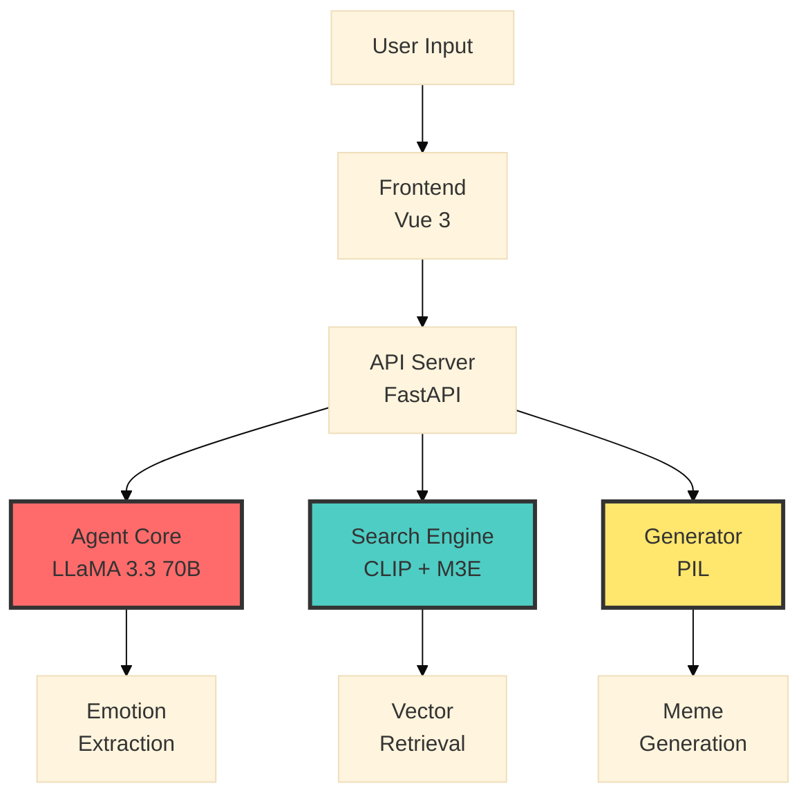
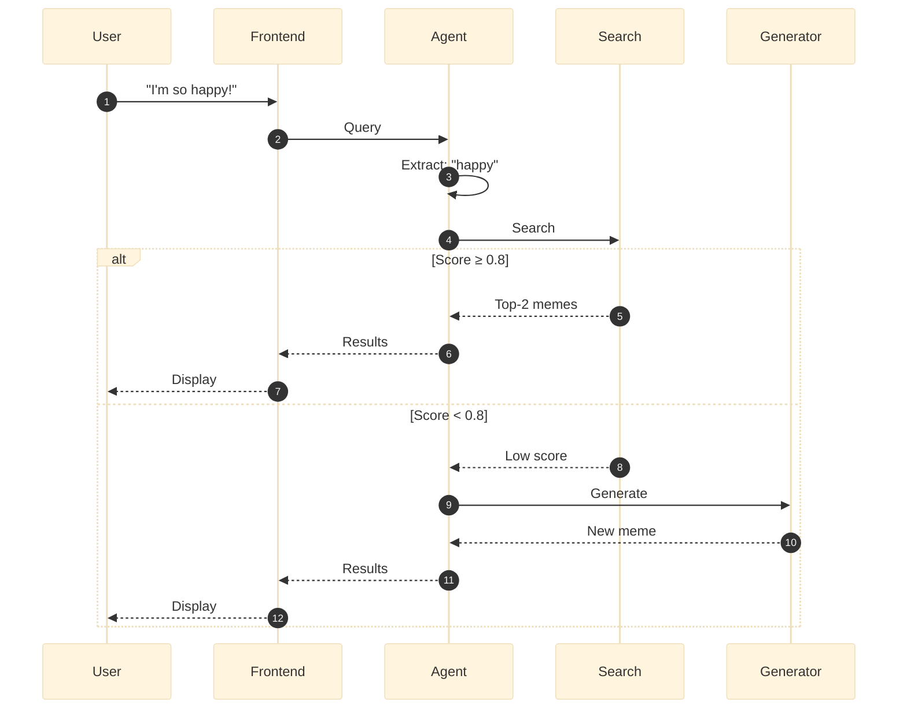
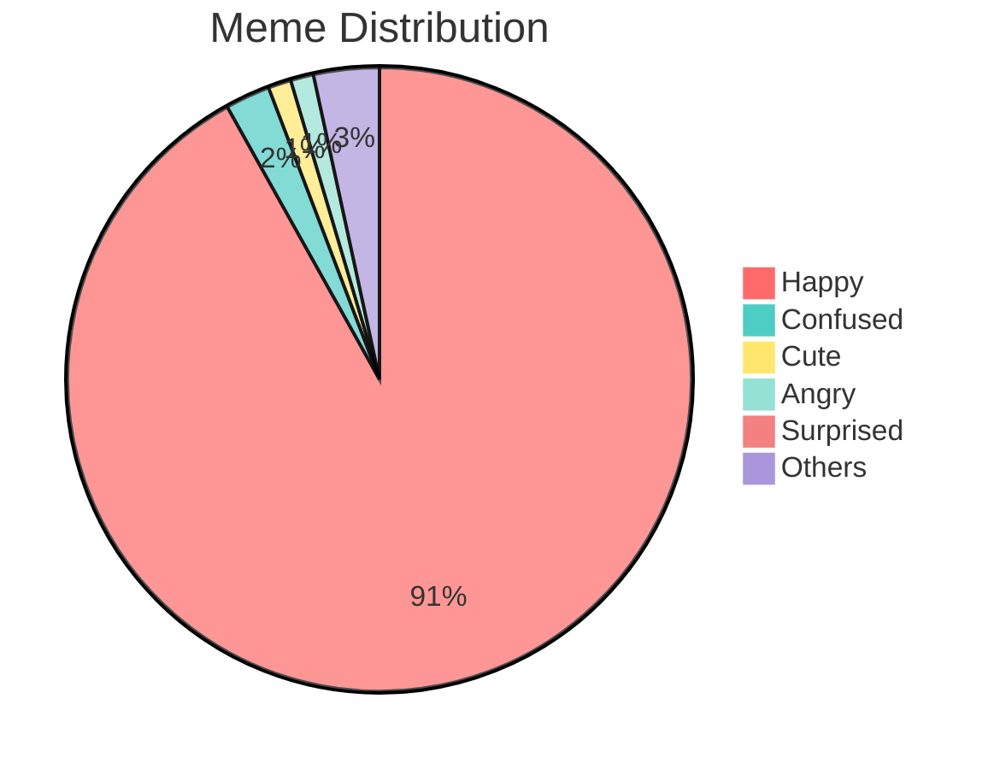

# MemeMatch 🎭

## AI-Powered Meme Recommendation System

<div class="abs-br m-6 flex gap-2">
  <a href="https://github.com/SakuraTokoyomi/memematch" target="_blank" alt="GitHub"
    class="text-xl slidev-icon-btn opacity-50 !border-none !hover:text-white">
    <carbon-logo-github />
  </a>
</div>

<!--
Welcome! Today I'm presenting MemeMatch - a system that helps people find the perfect meme to express their emotions.
-->

---
transition: slide-up
layout: default
---

# What is MemeMatch?

- 🧠 **Intelligent Emotion Recognition** - Powered by LLaMA 3.3 70B
- 🔍 **Multimodal Retrieval** - Combining CLIP image encoding and M3E text encoding
- 🎨 **Creative Generation** - Auto-generates personalized memes when needed
- 💬 **Conversational Interface** - Real-time streaming responses
- 🎯 **Top-N Recommendations** - Multiple candidates for better choices

<div class="bg-gradient-to-r from-blue-500/10 to-purple-500/10 py-[0.1rem] px-[2rem] rounded-lg border border-blue-500/30 ">

### The Problem We Solve

Users want to express emotions with memes but:
- Don't know which meme to use
- Can't describe the exact image
- Lack a comprehensive meme collection

</div>


<!--
We've all faced this: you want to share a meme that captures exactly how you're feeling, but you can't find the right one. 
MemeMatch solves this by understanding your emotions and 
either finding the perfect match from our collection
or generating a new one on the spot.
-->

---
transition: slide-up
---

# MemeMatch Demo

<v-click>
<div style="display: flex; justify-content: center;">
<video controls width="80%" src="/demo.mp4">
  Your browser does not support the video tag.
</video>
</div>
</v-click>

<!--
Let me show you how this works in practice. [click]
Watch how users simply describe their feelings, and the system responds with perfectly matched memes while showing its reasoning process in real-time.
-->

---

# System Architecture

<v-click>

<div style="display: flex; align-items: center; justify-content: center; transform: scale(1.2); transform-origin: top;">



</div>

</v-click>

<!--
Behind that smooth experience is a three-layer architecture: [click]
Vue 3 handles the interface, FastAPI manages requests, and the intelligence layer - powered by LLaMA 3.3, CLIP, and M3E - does the actual understanding, searching, and creating.
-->

---
transition: fade-out
---

# Core Workflow

<v-click>

<div style="display: flex; align-items: center; justify-content: center; transform: scale(1.6); transform-origin: top;">



</div>

</v-click>

<!--
Here's how these components work together: [click]
the agent extracts emotion keywords, searches our database, and makes a smart decision - if the match quality is high enough, it returns those results; otherwise, it automatically generates a new meme.
-->

---
layout: two-cols
style: "font-size: 0.9rem"
transition: slide-left
---

# Technical Deep Dive: Retrieval

<v-click>

### Multimodal Vector Search

</v-click>

<v-click>

**Text Encoding (M3E-base)**

$$
\mathbf{v}_{\text{text}} = \text{M3E}(q) \in \mathbb{R}^{768}
$$

</v-click>

<v-click>

**Image Encoding (CLIP)**

$$
\mathbf{v}_{\text{img}} = \text{CLIP}(I) \in \mathbb{R}^{512}
$$

</v-click>

<v-click>

**Reciprocal Rank Fusion**

$$
\text{score}(d) = \sum_{r \in R} \frac{1}{k + r(d)}
$$

where $k = 60$

</v-click>

::right::

<br>
<br>

<v-click>

**Normalized Score**

$$
s_{\text{norm}} = \frac{s_{\text{RRF}}}{s_{\text{max}}} \in [0, 1]
$$

</v-click>


<v-click>

<div class="bg-blue-500/10 py-[0.1rem] px-[2rem] my-[1rem] rounded border border-blue-500/30">

### Why RRF?

- More robust than score averaging
- Considers rank positions
- Handles different score distributions
- Works well with multimodal data

</div>

</v-click>


<v-click>

### Performance

- **Search Time**: 0.1-0.3s
- **Dataset**: 4,648 memes
- **Threshold**: 0.8

</v-click>

<!--
The search component [click]
uses two encoders - [click]
M3E for Chinese text and [click]
CLIP for images. The interesting part is how we combine them: [click]
instead of simple averaging, we use Reciprocal Rank Fusion, [click]
which considers rank positions and [click]
handles the different score scales much better. [click]
This gives us sub-second search across nearly 5,000 memes.
-->

---
transition: slide-up
---

# Technical Deep Dive: Agent

<div grid="~ cols-2 gap-4" style="font-size: 0.98rem">
<div>

<v-click>

### Emotion Extraction

Temperature: $T = 0.1$ (stable)

```python
keywords = agent.extract_emotion(
    "I'm so tired today"
)
# Output: ["tired"]
```

</v-click>

<br>

<v-click>

### Creative Generation

Temperature: $T = 0.8$ (creative)

```python
text = agent.generate_creative(
    query="I'm happy",
    keywords=["happy"]
)
# Output: "Flying high"
```

</v-click>

</div>
<div>

<v-click>

### Function Calling

```json
{
  "name": "search_meme",
  "parameters": {
    "query": "happy",
    "top_k": 2
  }
}
```

</v-click>

<br>

<v-click>

### Threshold Strategy

$$
\text{action} = \begin{cases}
\text{search} & s \geq 0.8 \\
\text{generate} & s < 0.8
\end{cases}
$$

where $s$ is similarity score

</v-click>

</div>
</div>

<!--
While the search engine finds memes, the agent orchestrates everything intelligently. [click]
It uses low temperature for stable emotion extraction [click]
but high temperature for creative text generation. [click]
Through function calling, it coordinates search and generation, [click]
automatically switching between them based on match quality.
-->

---
transition: fade
---

# Performance Metrics

<div grid="~ cols-2 gap-8" style="font-size: 0.9rem">
<div>

<v-click>

### Response Time

| Operation | Time |
|-----------|------|
| Emotion Extract | 0.5-1s |
| Vector Search | 0.1-0.3s |
| Meme Generate | 0.2-0.5s |
| **End-to-End** | **1-2s** |

</v-click>

<br>

<v-click>

<div class="bg-green-500/10 py-[0.1rem] px-[2rem] rounded border border-green-500/30">

### Accuracy

- **Top-1**: ~78%
- **Top-2**: ~85%
- **Threshold**: ≥ 0.8

</div>

</v-click>

</div>
<div>

<v-click>

### Dataset Scale
<div style="transform: scale(0.9); transform-origin: top;">


**Total**: 4,648 memes  
**Emotions**: 20 categories  
**Dimensions**: 768 + 512
</div>

</v-click>

</div>
</div>

<!--
So how well does this system perform? [click]
The entire process takes just 1 to 2 seconds end-to-end, [click]
and our Top-2 accuracy reaches 85% - [click]
meaning users find a suitable meme within the first two recommendations most of the time.
-->

---
transition: slide-up
---

# Tech Stack

<div grid="~ cols-3 gap-4" style="font-size: 0.97rem">

<v-click>

<div class="bg-red-500/10 py-[0.1rem] px-[2rem] rounded-lg border border-red-500/30">

### Backend

- **Python 3.10+**
- **FastAPI**
- **LLaMA 3.3 70B**
- **SambaNova Cloud**
- **CLIP ViT-B-32**
- **M3E-base**
- **FAISS**
- **Pillow**

</div>

</v-click>

<v-click>

<div class="bg-green-500/10 py-[0.1rem] px-[2rem] rounded-lg border border-green-500/30">

### Frontend

- **Vue 3**
- **Vite**
- **Axios**
- **EventSource (SSE)**
- **CSS Grid**

<br>

### Infrastructure

- **4,648 memes** (~700MB)
- **FAISS index** (~80MB)
- **Templates**: Drake, Doge, Wojak

</div>

</v-click>

<v-click>

<div class="bg-blue-500/10 py-[0.1rem] px-[2rem] rounded-lg border border-blue-500/30">

### Key Features

- ⚡ **Fast**: 1-2s response
- 🎯 **Accurate**: 85% Top-2
- 🔄 **Streaming**: Real-time
- 🎨 **Creative**: Auto-generate
- 💰 **Free**: SambaNova API

</div>

</v-click>

</div>

<!--
Achieving these results required careful technology choices. [click]
We built the backend with Python and FastAPI, using LLaMA 3.3 through SambaNova's free API. [click]
The frontend uses Vue 3 with Server-Sent Events for that real-time streaming experience. [click]
The entire stack is optimized for speed, accuracy, and cost-effectiveness.
-->

---
style: "font-size: 0.85rem"
transition: slide-left
---

# Key Innovations

<v-click>

### 1. Query Fusion Strategy

Combines original query with emotion keywords:

$$
q_{\text{fused}} = \begin{cases}
q_{\text{original}} + k_1 & \text{if } |q| > 2|k_1| \\
k_1 & \text{otherwise}
\end{cases}
$$

</v-click>

<v-click>

### 2. Streaming Response (SSE)

Real-time display of reasoning process:
- ✅ Emotion extraction status
- ✅ Search progress  
- ✅ Generation updates

</v-click>

<v-click>

### 3. Fallback Mechanism

$$
\text{Output} = \begin{cases}
\text{Search Results} & \text{if available} \\
\text{Generated Meme} & \text{if search fails} \\
\text{Error Message} & \text{if all fails}
\end{cases}
$$

</v-click>

<!--
Beyond just assembling good technologies, we introduced three key innovations. [click]
First, our query fusion strategy preserves semantic richness by intelligently combining user queries with extracted keywords. [click]
Second, streaming responses let users see the AI's thinking process unfold in real-time. [click]
And third, our three-tier fallback ensures users always get a meaningful result.
-->

---
transition: slide-up
---

# Future Roadmap


<div class="grid grid-cols-3 gap-8 mt-8">

<v-click>

<div class="text-center bg-gradient-to-br from-blue-500/10 to-blue-600/10 py-[0.1rem] px-[2rem] rounded-xl border border-blue-500/30 hover:scale-105 transition-transform">

## Short-term
### 1-2 months

- 📚 More templates (5+)
- 📤 User upload
- 🔄 Re-ranking
- 👍 Feedback system

</div>

</v-click>

<v-click>

<div class="text-center bg-gradient-to-br from-purple-500/10 to-purple-600/10 py-[0.1rem] px-[2rem] rounded-xl border border-purple-500/30 hover:scale-105 transition-transform">

## Mid-term
### 3-6 months

- 🖼️ Image search
- 🎯 Personalization
- 🌐 Community
- 📱 Mobile app

</div>

</v-click>

<v-click>

<div class="text-center bg-gradient-to-br from-pink-500/10 to-pink-600/10 py-[0.1rem] px-[2rem] rounded-xl border border-pink-500/30 hover:scale-105 transition-transform">

## Long-term
### 6-12 months

- 🎨 Stable Diffusion
- 🌍 Multi-language
- 🔥 Trending memes
- 💼 B2B API

</div>

</v-click>

</div>


<!--
Looking ahead, we're planning to expand in three phases: [click]
starting with more templates and user uploads, [click]
then adding image search and personalization, [click]
and eventually integrating Stable Diffusion for truly AI-generated memes and expanding to multiple languages.
-->

---
transition: fade
---

# Results & Impact

<div grid="~ cols-2 gap-8" style="font-size: 0.8rem">
<div>

<v-click>


### Quantitative Results

- ✅ **4,648** memes indexed
- ✅ **85%** Top-2 accuracy
- ✅ **1-2s** response time
- ✅ **20** emotion categories
- ✅ **100%** uptime (local)


</v-click>

<br>

<v-click>


### Qualitative Impact

- 🎯 **Faster** meme discovery
- 😊 **Better** emotion expression
- 🎨 **More** creative options
- 💬 **Easier** social interaction


</v-click>

</div>
<div>

<v-click>

### Technical Achievements

<v-click>

**LLM Agent**
- ✓ Function calling
- ✓ Multi-step reasoning
- ✓ Error handling

</v-click>

<v-click>

**Multimodal Retrieval**
- ✓ Text + Image fusion
- ✓ RRF algorithm
- ✓ FAISS optimization
</v-click>

<v-click>

**System Design**
- ✓ Microservices
- ✓ Streaming responses
- ✓ Graceful degradation
</v-click>


</v-click>

</div>
</div>

<!--
To summarize, we've built a system that's both technically sophisticated and genuinely useful - [click]
achieving 85% accuracy with sub-2-second responses [click]
while successfully implementing advanced [click][click]
LLM agents, [click]
multimodal retrieval, [click]
and robust system design. Most importantly, it makes expressing emotions through memes faster and more fun.
-->

---
layout: center
class: text-center
---

# Thank You! 🎭

## Questions?

<div class="pt-12 text-2xl">
  <carbon-logo-github /> github.com/SakuraTokoyomi/memematch
</div>

<div class="abs-br m-6 text-xl opacity-50">
  MemeMatch - Making Emotions Visual
</div>

<!--
Thank you! I'm happy to answer any questions about MemeMatch.
-->
