# MemeMatch 🎭

## AI-Powered Meme Recommendation System

<div class="abs-br m-6 flex gap-2">
  <a href="https://github.com/SakuraTokoyomi/memematch" target="_blank" alt="GitHub"
    class="text-xl slidev-icon-btn opacity-50 !border-none !hover:text-white">
    <carbon-logo-github />
  </a>
</div>

<!--
Welcome everyone! Today I'm excited to present MemeMatch, an intelligent meme recommendation system powered by LLM agents.
-->

---
transition: slide-up
layout: default
---

# What is MemeMatch?

<v-clicks>

- 🧠 **Intelligent Emotion Recognition** - Powered by LLaMA 3.3 70B
- 🔍 **Multimodal Retrieval** - Combining CLIP image encoding and M3E text encoding
- 🎨 **Creative Generation** - Auto-generates personalized memes when needed
- 💬 **Conversational Interface** - Real-time streaming responses
- 🎯 **Top-N Recommendations** - Multiple candidates for better choices

</v-clicks>


<v-click>

<div class="bg-gradient-to-r from-blue-500/10 to-purple-500/10 py-[0.1rem] px-[2rem] rounded-lg border border-blue-500/30 ">

### The Problem We Solve

Users want to express emotions with memes but:
- Don't know which meme to use
- Can't describe the exact image
- Lack a comprehensive meme collection

</div>

</v-click>

<!--
MemeMatch solves the common problem of finding the perfect meme to express your emotions. Instead of manually searching, our AI agent understands your feelings and recommends the best matches.
-->

---
transition: slide-up
---

# MemeMatch Demo

<v-click>
<div style="display: flex; justify-content: center;">
<video controls width="80%" src="/memematch/demo.mp4">
  Your browser does not support the video tag.
</video>
</div>
</v-click>
---

# System Architecture

<v-click>

<div style="display: flex; align-items: center; justify-content: center; transform: scale(1.2); transform-origin: top;">


</div>

</v-click>

<!--
Our architecture follows a clean separation of concerns. The frontend handles user interaction, the API layer manages requests, and the intelligence layer does the heavy lifting of understanding emotions and finding or generating memes.
-->

---
transition: fade-out
---

# Core Workflow

<v-click>

<div style="display: flex; align-items: center; justify-content: center; transform: scale(1.6); transform-origin: top;">


</div>

</v-click>

<!--
Here's how MemeMatch works: When a user inputs their emotion, the agent extracts keywords, searches our database, and if the match quality is good enough, returns the results. Otherwise, it generates a new meme on the fly.
-->

---
layout: two-cols
style: "font-size: 0.9rem"
transition: slide-left
---

# Technical Deep Dive: Retrieval

<v-click>

### Multimodal Vector Search

</v-click>

<v-click>

**Text Encoding (M3E-base)**

$$
\mathbf{v}_{\text{text}} = \text{M3E}(q) \in \mathbb{R}^{768}
$$

</v-click>

<v-click>

**Image Encoding (CLIP)**

$$
\mathbf{v}_{\text{img}} = \text{CLIP}(I) \in \mathbb{R}^{512}
$$

</v-click>

<v-click>

**Reciprocal Rank Fusion**

$$
\text{score}(d) = \sum_{r \in R} \frac{1}{k + r(d)}
$$

where $k = 60$

</v-click>

::right::

<br>
<br>

<v-click>

**Normalized Score**

$$
s_{\text{norm}} = \frac{s_{\text{RRF}}}{s_{\text{max}}} \in [0, 1]
$$

</v-click>


<v-click>

<div class="bg-blue-500/10 py-[0.1rem] px-[2rem] my-[1rem] rounded border border-blue-500/30">

### Why RRF?

- More robust than score averaging
- Considers rank positions
- Handles different score distributions
- Works well with multimodal data

</div>

</v-click>


<v-click>

### Performance

- **Search Time**: 0.1-0.3s
- **Dataset**: 4,648 memes
- **Threshold**: 0.8

</v-click>

<!--
Let me explain our retrieval algorithm. We use two separate encoders - M3E for Chinese text and CLIP for images. Then we apply Reciprocal Rank Fusion to combine the rankings, which has been proven to work better than simple score averaging.
-->

---
transition: slide-up
---

# Technical Deep Dive: Agent

<div grid="~ cols-2 gap-4" style="font-size: 0.98rem">
<div>

<v-click>

### Emotion Extraction

Temperature: $T = 0.1$ (stable)

```python
keywords = agent.extract_emotion(
    "I'm so tired today"
)
# Output: ["tired"]
```

</v-click>

<br>

<v-click>

### Creative Generation

Temperature: $T = 0.8$ (creative)

```python
text = agent.generate_creative(
    query="I'm happy",
    keywords=["happy"]
)
# Output: "Flying high"
```

</v-click>

</div>
<div>

<v-click>

### Function Calling

```json
{
  "name": "search_meme",
  "parameters": {
    "query": "happy",
    "top_k": 2
  }
}
```

</v-click>

<br>

<v-click>

### Threshold Strategy

$$
\text{action} = \begin{cases}
\text{search} & s \geq 0.8 \\
\text{generate} & s < 0.8
\end{cases}
$$

where $s$ is similarity score

</v-click>

</div>
</div>

<!--
The agent uses different temperature settings for different tasks. Low temperature for stable emotion extraction, high temperature for creative text generation. We also use a threshold-based strategy to decide when to generate new memes.
-->

---
transition: fade
---

# Performance Metrics

<div grid="~ cols-2 gap-8" style="font-size: 0.9rem">
<div>

<v-click>

### Response Time

| Operation | Time |
|-----------|------|
| Emotion Extract | 0.5-1s |
| Vector Search | 0.1-0.3s |
| Meme Generate | 0.2-0.5s |
| **End-to-End** | **1-2s** |

</v-click>

<br>

<v-click>

<div class="bg-green-500/10 py-[0.1rem] px-[2rem] rounded border border-green-500/30">

### Accuracy

- **Top-1**: ~78%
- **Top-2**: ~85%
- **Threshold**: ≥ 0.8

</div>

</v-click>

</div>
<div>

<v-click>

### Dataset Scale
<div style="transform: scale(0.9); transform-origin: top;">


**Total**: 4,648 memes  
**Emotions**: 20 categories  
**Dimensions**: 768 + 512
</div>

</v-click>

</div>
</div>

<!--
Our system performs very well with end-to-end latency under 2 seconds. The Top-2 accuracy reaches 85%, which means in most cases, users can find a suitable meme within the top 2 recommendations.
-->

---
transition: slide-up
---

# Tech Stack

<div grid="~ cols-3 gap-4" style="font-size: 0.97rem">

<v-click>

<div class="bg-red-500/10 py-[0.1rem] px-[2rem] rounded-lg border border-red-500/30">

### Backend

- **Python 3.10+**
- **FastAPI**
- **LLaMA 3.3 70B**
- **SambaNova Cloud**
- **CLIP ViT-B-32**
- **M3E-base**
- **FAISS**
- **Pillow**

</div>

</v-click>

<v-click>

<div class="bg-green-500/10 py-[0.1rem] px-[2rem] rounded-lg border border-green-500/30">

### Frontend

- **Vue 3**
- **Vite**
- **Axios**
- **EventSource (SSE)**
- **CSS Grid**

<br>

### Infrastructure

- **4,648 memes** (~700MB)
- **FAISS index** (~80MB)
- **Templates**: Drake, Doge, Wojak

</div>

</v-click>

<v-click>

<div class="bg-blue-500/10 py-[0.1rem] px-[2rem] rounded-lg border border-blue-500/30">

### Key Features

- ⚡ **Fast**: 1-2s response
- 🎯 **Accurate**: 85% Top-2
- 🔄 **Streaming**: Real-time
- 🎨 **Creative**: Auto-generate
- 💰 **Free**: SambaNova API

</div>

</v-click>

</div>

<!--
We carefully selected our tech stack to balance performance, cost, and ease of development. Using SambaNova Cloud gives us access to a powerful 70B model for free, while FAISS provides lightning-fast vector search.
-->

---
transition: fade-out
---

# Live Demo Flow

<div grid="~ cols-2 gap-8" style="font-size: 0.8rem">
<div>

<v-click>

### User Journey

```mermaid
%%{init: {'theme':'base'}}%%
stateDiagram-v2
    [*] --> Input
    Input --> Extract
    Extract --> Search
    Search --> Check
    
    Check --> Return: ≥0.8
    Check --> Generate: <0.8
    
    Return --> Display
    Generate --> Display
    
    Display --> [*]
    Display --> Creative: Click
    Creative --> Display
```

<div style="display: flex; align-items: center; justify-content: center; transform: scale(0.55); transform-origin: top;">



</div>

</v-click>

</div>
<div>

<v-clicks>

<div>

**Input**  
"I'm so tired"

</div>

<div>

**Step 1: Extract**  
Keywords: \["tired"\]

</div>

<div>

**Step 2: Search**  
Top-1: 0.85 ✓  
Top-2: 0.82 ✓

</div>

<div>

**Step 3: Display**  
Show 2 memes + explanation

</div>

<div>

**Optional: Creative**  
Text: "Exhausted"  
Template: Wojak

</div>

</v-clicks>

</div>
</div>

<!--
Let me walk you through a typical user interaction. The user inputs their emotion, we extract keywords, search our database, and return results. If the user wants something more creative, they can click the generate button.
-->
---
style: "font-size: 0.85rem"
transition: slide-left
---

# Key Innovations

<v-click>

### 1. Query Fusion Strategy

Combines original query with emotion keywords:

$$
q_{\text{fused}} = \begin{cases}
q_{\text{original}} + k_1 & \text{if } |q| > 2|k_1| \\
k_1 & \text{otherwise}
\end{cases}
$$

</v-click>

<v-click>

### 2. Streaming Response (SSE)

Real-time display of reasoning process:
- ✅ Emotion extraction status
- ✅ Search progress  
- ✅ Generation updates

</v-click>

<v-click>

### 3. Fallback Mechanism

$$
\text{Output} = \begin{cases}
\text{Search Results} & \text{if available} \\
\text{Generated Meme} & \text{if search fails} \\
\text{Error Message} & \text{if all fails}
\end{cases}
$$

</v-click>

<!--
Our key innovations include a smart query fusion strategy that preserves semantic information, real-time streaming for better UX, and a robust fallback mechanism that ensures users always get a result.
-->

---
transition: slide-up
---

# Future Roadmap


<div class="grid grid-cols-3 gap-8 mt-8">

<v-click>

<div class="text-center bg-gradient-to-br from-blue-500/10 to-blue-600/10 py-[0.1rem] px-[2rem] rounded-xl border border-blue-500/30 hover:scale-105 transition-transform">

## Short-term
### 1-2 months

- 📚 More templates (5+)
- 📤 User upload
- 🔄 Re-ranking
- 👍 Feedback system

</div>

</v-click>

<v-click>

<div class="text-center bg-gradient-to-br from-purple-500/10 to-purple-600/10 py-[0.1rem] px-[2rem] rounded-xl border border-purple-500/30 hover:scale-105 transition-transform">

## Mid-term
### 3-6 months

- 🖼️ Image search
- 🎯 Personalization
- 🌐 Community
- 📱 Mobile app

</div>

</v-click>

<v-click>

<div class="text-center bg-gradient-to-br from-pink-500/10 to-pink-600/10 py-[0.1rem] px-[2rem] rounded-xl border border-pink-500/30 hover:scale-105 transition-transform">

## Long-term
### 6-12 months

- 🎨 Stable Diffusion
- 🌍 Multi-language
- 🔥 Trending memes
- 💼 B2B API

</div>

</v-click>

</div>


<!--
We have an exciting roadmap ahead. In the short term, we'll expand our template library and add user feedback. Mid-term, we'll add image search and personalization. Long-term, we're looking at AI-generated memes using Stable Diffusion and expanding to multiple languages.
-->

---
transition: fade
---

# Results & Impact

<div grid="~ cols-2 gap-8" style="font-size: 0.8rem">
<div>

<v-click>


### Quantitative Results

- ✅ **4,648** memes indexed
- ✅ **85%** Top-2 accuracy
- ✅ **1-2s** response time
- ✅ **20** emotion categories
- ✅ **100%** uptime (local)


</v-click>

<br>

<v-click>


### Qualitative Impact

- 🎯 **Faster** meme discovery
- 😊 **Better** emotion expression
- 🎨 **More** creative options
- 💬 **Easier** social interaction


</v-click>

</div>
<div>

<v-click>

### Technical Achievements

<v-click>

**LLM Agent**
- ✓ Function calling
- ✓ Multi-step reasoning
- ✓ Error handling

</v-click>

<v-click>

**Multimodal Retrieval**
- ✓ Text + Image fusion
- ✓ RRF algorithm
- ✓ FAISS optimization
</v-click>

<v-click>

**System Design**
- ✓ Microservices
- ✓ Streaming responses
- ✓ Graceful degradation
</v-click>


</v-click>

</div>
</div>

<!--
Our project has achieved impressive results both quantitatively and qualitatively. We've built a robust system that not only works well technically but also provides real value to users in expressing their emotions.
-->

---
layout: center
class: text-center
---

# Thank You! 🎭

## Questions?

<div class="pt-12 text-2xl">
  <carbon-logo-github /> github.com/SakuraTokoyomi/memematch
</div>

<div class="abs-br m-6 text-xl opacity-50">
  MemeMatch - Making Emotions Visual
</div>

<!--
Thank you for your attention! I'm happy to answer any questions you might have about MemeMatch, our architecture, or the technical details.
-->
